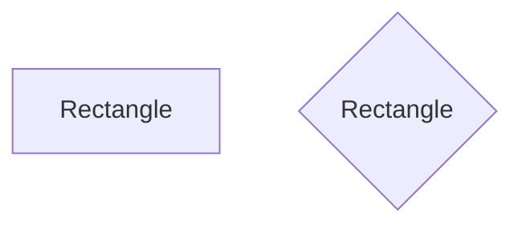

# Perimeter of a Rectange
## Backgroud
One of the first geometry problems you learn is how to calculate the perimeter of a rectangle. After this, by taking small steps, you learn more advanced maths. It is the same with programming: first you takesmall steps, then you build up higher. Let's go back and implement a programm that calculates a rectangle's perimeter.
=======
course: CS50P
week: 0
topics: "[\"Functions\", \"Variables\"]"
---
# Rectangle! test update 5
>>>>>>> dana/main:python/0/rectagle/rectangle.md

In a file called `rectangle.py`, implement a program in Python that prompts the user for the length of a rectangle, then prompts for the height of the rectangle. Your program should then sends those inputs to a function called `calc_perimeter` that returns the length of the perimeter of that rectangle. Finally, print the returned value and tell the user how long the perimeter of their rectangle is.


## Understanding
A rectangle is any shape with four straight sides that has right angles (90 degrees angles) in each corner. A rectangle is any shape like the following:

If laid on its side, a rectangle has two vertical sides who are lengths equal to each other, and two horizontal sides whose lengths may be different from the vertical, but are equal *to each other*. A rectangle is said to have a `height` (the length of a vertical side) and a `width` (the length of a horizontal side). As you may have guessed, a square is a subtype of rectangle where the height and width are the same.

Your programm will need to take in two inputs, which would be the two sides of the perimeter (`side a` and `side b`). Then with the help of `calc_perimeter` function you are going to calculate the perimeter, and print it.

## Before You Begin
Execute cd by itself in your terminal window. You should find that your terminal window’s prompt resembles the below:
```bash
$
```
Next execute
```bash
mkdir rectangle
```
to make a folder called `rectangle` in your codespace.

Then execute
```bash
cd rectangle
```
to change directories into that folder. You should now see your terminal prompt as `rectangle/ $`. You can now execute
```bash
code rectangle.py
```
to make a file called `rectangle.py` where you’ll write your program.

## Specification
You will implement two functions: `main` and `calc_perimeter`. 
    In the main function you will prompt the user for two numbers (side a, and side b), then call the calc_perimeter function, passing in the side a and side b. Then you will print the perimeter. 
    
In the calc_perimeter function you will take in two inputs as the function parameters which would be the two sides of 
a rectangle. Then you will calculate the perimeter, and return the number. 
    

<details>
    <summary>Hints</summary>
Dont forget that input returns a string, so you will have to convert it to an int https://www.w3schools.com/python/ref_func_int.asp
    
To define a function which can take in parameters you can check out this link https://www.w3schools.com/python/python_functions.asp
</details>

## Before You Begin
Create a new folder called `perimeter` (feel free to copy thin into your terminal):
```
mdkir perimeter
cd perimeter
```
Create a new file called `perimeter.py`:
```
code perimeter.py
```
Now you can code in the new file created.

# How to Test
### 1)
Enter this as the folowing input:
```
Side a: 5
Side b: 2
```
You are supposed to get 14 as the output
```
Perimeter: 14
```

### 2)
Enter this as the folowing input:
```
Side a: 10
Side b: 5
```
You are supposed to get 30 as the output
```
Perimeter: 30
```

### 3)
Enter this as the folowing input:
```
Side a: 2
Side b: 4
```
You are supposed to get 12 as the output
```
Perimeter: 12
```

## How to submit

```
idk what to write here lol
```
