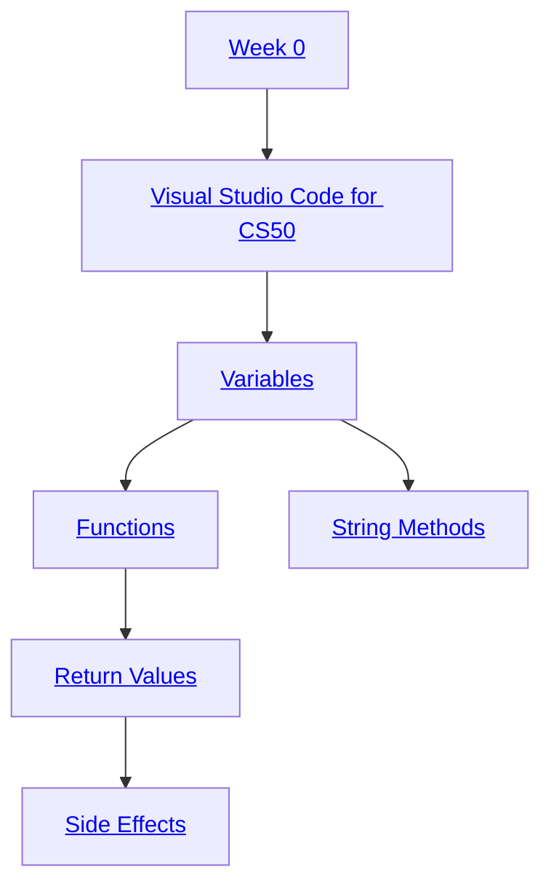
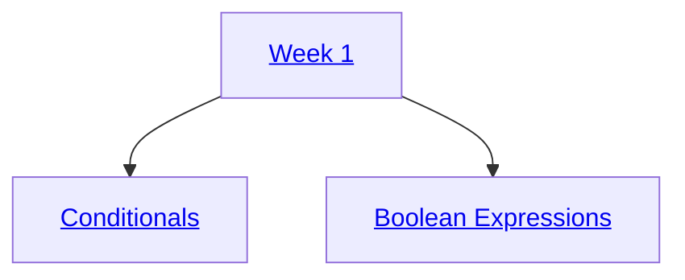
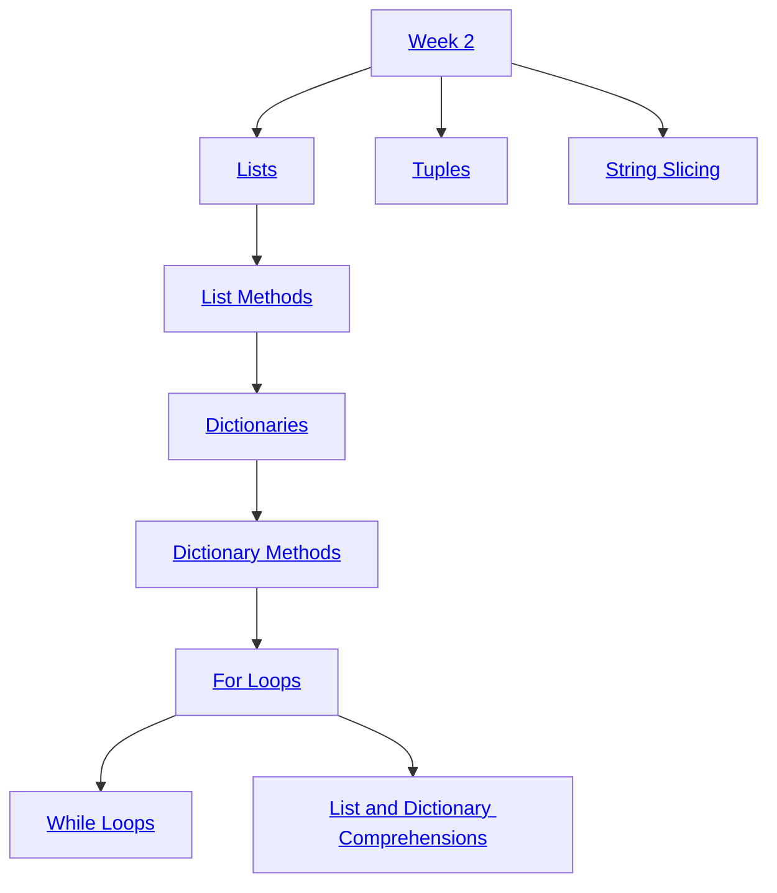
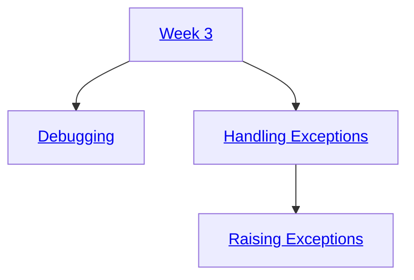
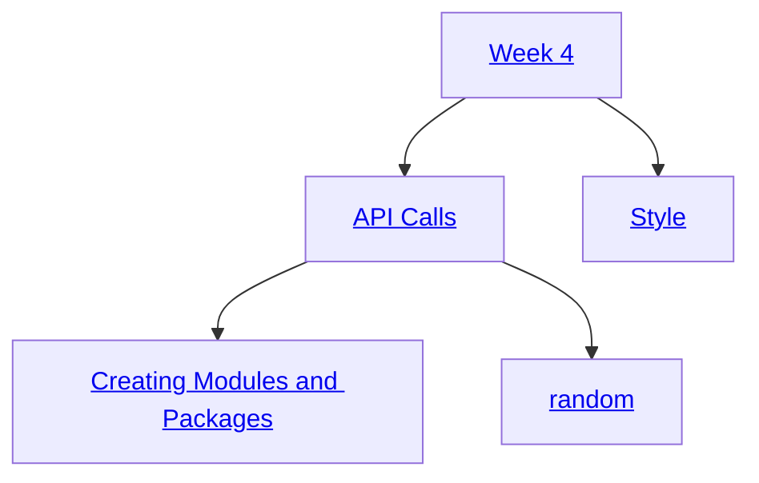
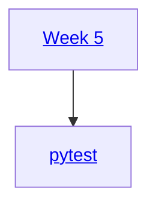
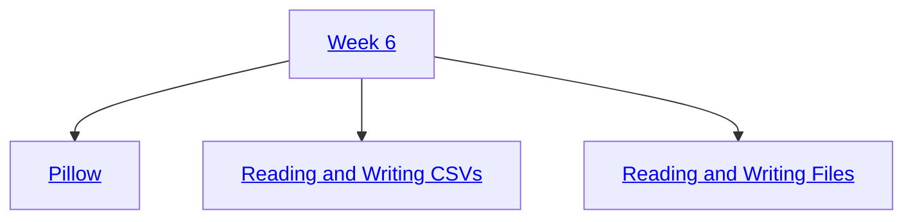
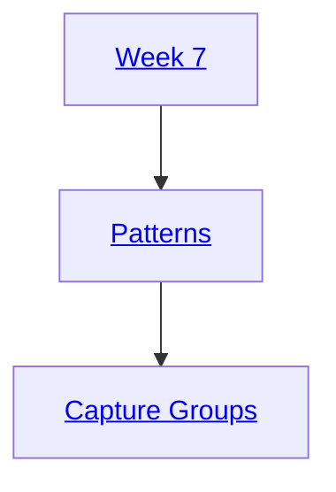
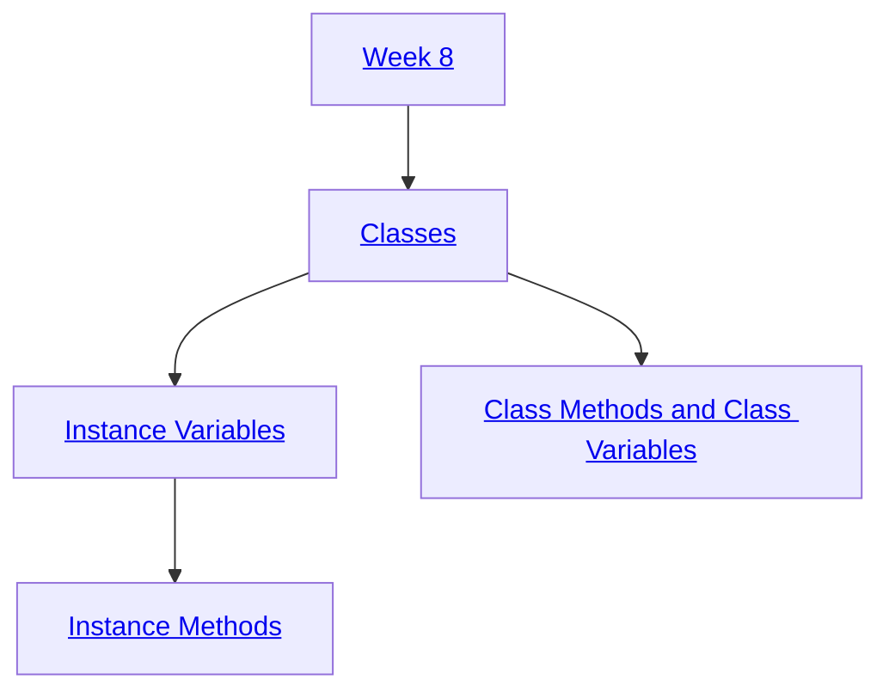
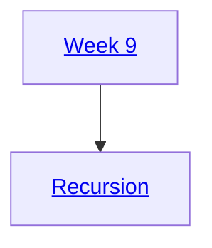

> [!WARNING]
> Some shorts may include concepts not covered for that week. You can ignore the advanced code that made it in by accident and focus on the concept the video is about. Do not worry; the more advanced code you see will be covered later in the course.

