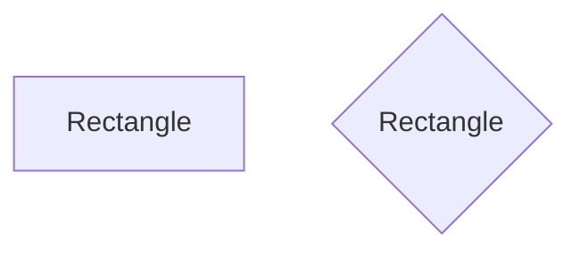

# Perimeter of a Rectange
## Backgroud
One of the first geometry problems you learn is how to calculate the perimeter of a rectangle. After this, by taking small steps, you learn more advanced maths. It is the same with programming: first you takesmall steps, then you build up higher. Let's go back and implement a programm that calculates a rectangle's perimeter.

In a file called `rectangle.py`, implement a program in Python that prompts the user for the length of a rectangle, then prompts for the height of the rectangle. Your program should then sends those inputs to a function called `calc_perimeter` that returns the length of the perimeter of that rectangle. Finally, print the returned value and tell the user how long the perimeter of their rectangle is.


## Understanding
A rectangle is any shape with four straight sides that has right angles (90 degrees angles) in each corner. A rectangle is any shape like the following:

If laid on its side, a rectangle has two vertical sides who are lengths equal to each other, and two horizontal sides whose lengths may be different from the vertical, but are equal *to each other*. A rectangle is said to have a `height` (the length of a vertical side) and a `width` (the length of a horizontal side). As you may have guessed, a square is a subtype of rectangle where the height and width are the same.

Your programm will need to take in two inputs, which would be the two sides of the perimeter (`side a` and `side b`). Then with the help of `calc_perimeter` function you are going to calculate the perimeter, and print it.

## Before You Begin
Execute cd by itself in your terminal window. You should find that your terminal window’s prompt resembles the below:
```bash
$
```
Next execute
```bash
mkdir rectangle
```
to make a folder called `rectangle` in your codespace.

Then execute
```bash
cd rectangle
```
to change directories into that folder.

You should now see your terminal prompt as `rectangle/ $`. You can now execute
```bash
code rectangle.py
```
to make a file called `rectangle.py` where you’ll write your program.

## Specification
You will implement two functions: `main` and `calc_perimeter`. 

In the `main` function you will prompt the user for two numbers (the `height` and the `width`), then call the `calc_perimeter` function, passing in the values for the height and the width as argument.
    
In the `calc_perimeter` function you will take in two inputs as the function parameters which would be the two sides of 
a rectangle. Then you will calculate the perimeter, and return the number. 
    

<details>
    <summary>Hints</summary>
        <p>Don't forget that input returns a string, and you need an int: <a href="https://docs.python.org/3/library/functions.html#int">https://docs.python.org/3/library/functions.html#int</a>
        <p>More about functions: <a href="https://docs.python.org/3/tutorial/controlflow.html#defining-functions">https://docs.python.org/3/tutorial/controlflow.html#defining-functions</a></p>
</details>

# How to Test
* Run your program with `python rectangle.py`. Type `5` and press Enter. At the next prompt, type `3` and press Enter. Your program should output `14`.

* Run your program with `python rectangle.py`. Type `10` and press Enter. At the next prompt, type `5` and press Enter. Your program should output `30`.

* Run your program with `python rectangle.py`. Type `2` and press Enter. At the next prompt, type `4` and press Enter. Your program should output `12`.

If you run into an error saying your file cannot be opened, retrace your steps to be sure that you are inside your `rectangle` folder and have saved your `rectangle.py` file there.

You can execute the below to check your code using `check50`, a program that CS50 will use to test your code:
```bash
check50 alum-challenges/problems/main/python/week-0/rectangle/tests
```
* **<span style="color: yellowgreen;">Green</span>** smiles mean your program has passed a test!
* **<span style="color: firebrick;">Red</span>** frowns will indicate your program output something unexpected.
* **<span style="color: orange;">Orange</span>** neutral faces mean you must fix the failed check before those checks can run.

Visit the URL that `check50` outputs to see the input `check50` handed to your program, what output it expected, and what output your program actually gave.

## How to Submit
> *Coming soon*
