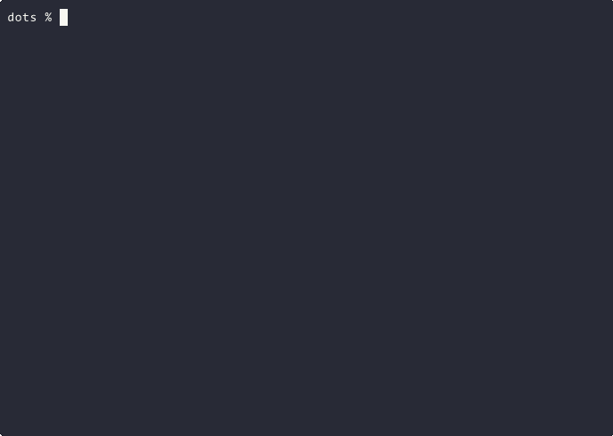

# Dots
## Background
In the competitive world of data compression, a startup called Dot Decode Inc. believed they had a game-changing algorithm. Their method, developed by the eccentric Dr. Dot, used dots to indicate character positions within a string.  Each dot before a character represented its index.  For example, "...5.C..S....0" would decode to "CS50".  Dr. Dot has vanished, leaving behind only an encoded message.  The company's future depends on cracking his code. Can you write a program to decode these messages and help solve the mystery of Dr. Dot's disappearance?

## Understanding
[](https://asciinema.org/a/a7DuFslJcSHEqSQ4v4nPNy27F)


In a file called `dots.py`, implement a program that takes a jumbled, encoded message consisting of letters and periods and prints the decoded message, where the position of each letter in the decoded message is equal to the number of periods before it in the encoded message
for example: 

> [!NOTE]
> The indexes are starting from 1! 


The input `...5.C..S....0`, has output `CS50`

`...5` means that the character `5` has the position number `3` in the string.


`.C` means that the character `C` has the position number `1` in the string.


`..S` means that the character `S` has the position number `2` in the string.


`....0` means that the character `0` has the position number `4` in the string.

You can assume that there will be no 0 indexes letters, no repeated indexes.

The decoding algorithm should be coded inside the `decode` function. The function should accept a string, then return the decoded version of it.

## Before You Begin
Execute cd by itself in your terminal window. You should find that your terminal window’s prompt resembles the below:
```bash
$
```
Next execute
```bash
mkdir dots
```
to make a folder called `dots` in your codespace.

Then execute
```bash
cd dots
```
to change directories into that folder.

You should now see your terminal prompt as `dots/ $`. You can now execute
```bash
code dots.py
```
to make a file called `dots.py` where you’ll write your program.

## Specification


Use this code as a template. Edit only the body of `decode`:
```python
def main():

    text = input(": ")
    print(decode(text))

def decode(text):
    raise NotImplementedError

if __name__ == "__main__":
    main()
```

<details>
    <summary>Hints</summary>
        <p>More about functions: <a href="https://docs.python.org/3/tutorial/controlflow.html#defining-functions">https://docs.python.org/3/tutorial/controlflow.html#defining-functions</a></p>
        <p>More about lists: <a href="https://docs.python.org/3/tutorial/datastructures.html#more-on-lists">https://docs.python.org/3/tutorial/datastructures.html#more-on-lists</a></p>
        <p>More about dictionaries: <a href="https://docs.python.org/3/tutorial/datastructures.html#dictionaries">https://docs.python.org/3/tutorial/datastructures.html#dictionaries</a> </p>
</details>

# How to Test
* Run your program with `python dots.py`. Your program should ask for input. Type in `..o...t.d` and press Enter. Your program should output `dot`.


* Run your program with `python dots.py`. Type `....k..u.d...c.....y` and press Enter. Your program should output:
```
ducky
```

* Run your program with `python dots.py`. Type `..S.C...5....0` and press Enter. Your program should output:
```
CS50
```
* Run your program with `python dots.py`. Type `......,.....o...l..e................y............... ..........w.............r....l..............e.........o........h....... .................o...................?..................u............a........... .H` and press Enter. Your program should output:
```
Hello, how are you?
```

If you run into an error saying your file cannot be opened, retrace your steps to be sure that you are inside your `dots` folder and have saved your `dots.py` file there.

If you get an error saying `python` is not found, try replacing it with `python3` in the terminal command instead.

You can execute the below to check your code using `check50`, a program that CS50 will use to test your code:
```bash
check50 alum-challenges/problems/main/python/week-2/dots/tests
```
* **<span style="color: yellowgreen;">Green</span>** smiles mean your program has passed a test!
* **<span style="color: firebrick;">Red</span>** frowns will indicate your program output something unexpected.
* **<span style="color: orange;">Orange</span>** neutral faces mean you must fix the failed check before those checks can run.

Visit the URL that `check50` outputs to see the input `check50` handed to your program, what output it expected, and what output your program actually gave.

## How to Submit
> *Coming soon*
