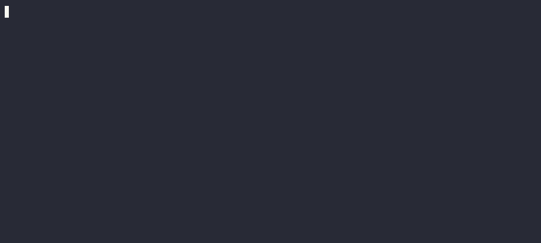

# Playlist
## Backgroud
From vinyl records, to casette tapes, to CDs, and back to vinyl records, people have been fascinated with creating customized collections of songs and giving them as "mixtapes" to each other. Most people do things digitally now, but the playlist is still a staple in modern music.

In a file called `playlist.py`, implement a program in Python that prompts the user for the number of songs they want to add to their playlist. Your program should then send that input to a function called `create_playlist` that asks the user for information about the songs in the playlist, and when done taking input, returns the playlist as a list of dictionaries. Finally, your program should print the playlist.

## Understanding

A playlist involves 3 key terms:

*`Song`* - a particular work of music by a musical artist.

*`Artist`* (also known as a musical artist) - the person or group who creates, performs, and often produces songs as a form of artistic expression.

*`Playlist`* - an ordered collection of songs.

Each playlist has one or more songs. Each song has a title and an artist. You can represent this information as a list of dictionaries, with each dictionary containing a key for the song title and a key for the artist name. 

## Before You Begin
Execute cd by itself in your terminal window. You should find that your terminal window’s prompt resembles the below:
```bash
$
```
Next execute
```bash
mkdir playlist
```
to make a folder called `playlist` in your codespace.

Then execute
```bash
cd playlist
```
to change directories into that folder.

You should now see your terminal prompt as `playlist/ $`. You can now execute
```bash
code playlist.py
```
to make a file called `playlist.py` where you’ll write your program.

## Specification
#### Demo
[](https://asciinema.org/a/645107)

You will implement two functions: **`main`** and **`create_playlist`**

The `create_playlist` function should take one input as a parameter, which is the number of songs they want to add, then ask for the songs using the following format. First, ask for the first song's title with a prompt saying: `Title: `. If the title input is empty, it should reject the input and reprompt, starting over from the title. Once a valid title has been entered, it should ask for the song's artist with a prompt saying: `Artist: `. If the artist input is empty, it should reprompt the the user, starting over from the song title (NOT just the artist). Once the user has successfully entered both values, add the song to the playlist. The playlist should be of type `list` with items of type `dict`. The keys for each dictionary sould be the song's `title` and `artist`. Repeat this process until the playlist is full, based on the number of songs given as the input paramete:. When the list if full, return the playlist.

The `main` function should prompt the user for the number of songs they want to add to the playlist. If the input provided is not a positive number, then it should reprompt the user. Then it will call the `create_playlist` function, passing in the number of songs as an argument, and assign the result into a variable. Then it should print the playlist with the following format:
```
1. Half Way There by Bon Jovi
2. Never Gonna Give You Up by Rick Astley
...
etc.
```


Use this code as a template. Edit only the body of `main` and `create_playlist`:
```python
def main():
    # TODO
    raise NotImplementedError


def create_playlist(num_songs):
    """Ask the user for a title and artist with the following prompts:

    Title: 
    Artist: 
    
    Return a list of dicts.
    """
    # TODO
    raise NotImplementedError


if __name__ == "__main__":
    main()
```

<details>
    <summary>Hints</summary>
        <p>More about functions: <a href="https://docs.python.org/3/tutorial/controlflow.html#defining-functions">https://docs.python.org/3/tutorial/controlflow.html#defining-functions</a></p>
        <p>More about lists: <a href="https://docs.python.org/3/tutorial/datastructures.html#more-on-lists">https://docs.python.org/3/tutorial/datastructures.html#more-on-lists</a></p>
        <p>More about dictionaries: <a href="https://docs.python.org/3/tutorial/datastructures.html#dictionaries">https://docs.python.org/3/tutorial/datastructures.html#dictionaries</a> </p>
</details>

# How to Test
* Run your program with `python playlist.py`. Type `cat` and press Enter. Your program should ask again for the number of songs. Then type `1` and press Enter. At the next prompt, simply press Enter without typing. Your program should ask again for the song title. Type `Twenties` and press Enter. At the next prompt, press Enter again without typing anything. Your program should ask again, starting over with the song title. Finally, at the next prompt, type `Twenties` and press Enter. Then type `Ghost` and press Enter. Upon receiving valid input for all of the prompts, your program should output:
```
1. Twenties by Ghost
```
* Run your program with `python playlist.py`. Type `3` and press Enter. At the next prompt, type `Twenties` and press Enter. Then type `Ghost` folowed by Enter. Then, type `Valentine` and press Enter. Then type `Maneskin` folowed by Enter. Then, type `Yes, and?` and press Enter. Then type `Ariana Grande` folowed by Enter. Your program should output:
```
1. Twenties by Ghost
2. Valentine by Maneskin
3. Yes, and? by Ariana Grande
```

If you run into an error saying your file cannot be opened, retrace your steps to be sure that you are inside your `playlist` folder and have saved your `playlist.py` file there.

If you get an error saying `python` is not found, try replacing it with `python3` in the terminal command instead.

You can execute the below to check your code using `check50`, a program that CS50 will use to test your code:
```bash
check50 alum-challenges/problems/main/python/week-2/playlist/tests
```
* **<span style="color: yellowgreen;">Green</span>** smiles mean your program has passed a test!
* **<span style="color: firebrick;">Red</span>** frowns will indicate your program output something unexpected.
* **<span style="color: orange;">Orange</span>** neutral faces mean you must fix the failed check before those checks can run.

Visit the URL that `check50` outputs to see the input `check50` handed to your program, what output it expected, and what output your program actually gave.

## How to Submit
> *Coming soon*
